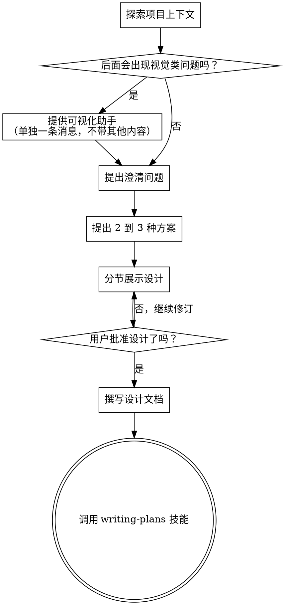

# 把想法打磨成设计

通过自然的协作式对话，把零散想法打磨成完整的设计和规格。

先理解当前项目上下文，然后一次只问一个问题**(使用 vscode.askQuestions tool)**来收敛想法。等你真正理解要构建什么之后，再提出设计并获得用户批准。

<HARD-GATE>
在你提出设计并获得用户批准之前，不要调用任何实现类技能，不要写代码，不要搭项目脚手架，也不要进行任何实现动作。不论项目看起来多简单，这条规则都适用。
</HARD-GATE>

## 反模式：“这太简单了，不需要设计”

每个项目都必须经过这个流程。待办清单、单函数工具、配置变更，全都一样。真正浪费时间的，往往正是这些“看起来很简单”的项目，因为未经检验的假设最容易在这里埋坑。设计可以很短，但你必须把它明确说出来并获得批准。

## 检查清单

你必须为下面每一项创建任务，并按顺序完成：

1. **探索项目上下文** — 检查文件、文档、近期提交
2. **提供可视化助手**（如果话题会涉及视觉问题）— 必须单独发一条消息，不能和澄清问题混在一起。见下方“可视化助手”章节。
3. **提出澄清问题** — 一次只问一个，弄清目的、约束和成功标准**(使用 vscode.askQuestions tool)**
4. **提出 2 到 3 种方案** — 给出权衡和你的推荐**(使用 vscode.askQuestions tool)**
5. **展示设计** — 按复杂度分节说明，每一节都要获得用户批准**(使用 vscode.askQuestions tool)**
6. **撰写设计文档** — 保存到 `docs/superpowers/specs/YYYY-MM-DD-<topic>-design.md` 并提交
7. **转入实现阶段** — 调用 writing-plans 技能来创建实现计划

## 流程图

**终止状态是调用 writing-plans。** 不要调用 frontend-design、mcp-builder 或任何其他实现类技能。brainstorming 之后唯一允许调用的技能就是 writing-plans。

## 流程

**理解想法：**

- 先检查当前项目状态（文件、文档、近期提交）
- 在提细节问题之前先判断范围：如果请求描述了多个彼此独立的子系统（例如“做一个带聊天、文件存储、计费和分析的平台”），要立刻指出这一点。不要把时间花在一个本该先拆分的项目上继续追问细节。
- 如果项目大到无法用一个 spec 解决，就帮助用户拆成多个子项目：有哪些独立部分、它们之间怎么关联、应该按什么顺序构建。然后只对第一个子项目走完整个 brainstorming 流程。每个子项目都应有自己独立的 spec → plan → implementation 周期。
- 对于范围合适的项目，一次只问一个问题来收敛想法
- 优先使用多选题，但开放式问题也可以
- 每条消息只问一个问题；如果某个主题还需要继续深入，就拆成多轮提问
- 重点是搞清楚：目的、约束、成功标准

**探索方案：**

- 提出 2 到 3 种不同方案，并说明取舍
- **(使用 vscode.askQuestions tool)**呈现这些选项 ，同时给出你的推荐与原因
- 先讲你最推荐的方案，并解释为什么

**展示设计：**

- 一旦你认为自己已经理解要构建的东西，就开始展示设计
- 每一节的篇幅应与复杂度匹配：简单的几句话就够，复杂的可以写到 200 到 300 字
- 每展示完一节，都要询问用户目前看起来是否正确 **(使用 vscode.askQuestions tool)**
- 覆盖这些方面：架构、组件、数据流、错误处理、测试
- 如果某个地方讲不通，准备好退回去继续澄清

**为隔离与清晰而设计：**

- 把系统拆成更小的单元，让每个单元只有一个清晰目的，通过定义明确的接口通信，并且可以独立理解和测试
- 对每个单元，你都应该能回答：它做什么、如何使用、依赖什么
- 别人能不能不读内部实现就理解这个单元？你能不能在不影响使用方的前提下改动它的内部？如果不能，边界就还不够好
- 更小、边界清晰的单元也更适合你工作：你对能一次放进上下文里的代码推理得更好，而专注的文件也更容易被可靠地修改。文件一旦越来越大，通常说明它做得太多了

**在现有代码库中工作：**

- 在提出改动之前先探索当前结构，遵循现有模式
- 如果现有代码里有会影响本次工作的结构性问题（例如文件过大、边界不清、职责缠绕），可以把有针对性的改进纳入设计，这才是一个好开发者处理现有代码的方式
- 不要提出与当前目标无关的重构。始终保持聚焦

## 设计之后

**文档：**

- 把已确认的设计（spec）写入 `docs/superpowers/specs/YYYY-MM-DD-<topic>-design.md`
  - （如果用户对 spec 存放位置另有偏好，以用户偏好为准）
- 如果可用，使用 elements-of-style:writing-clearly-and-concisely 技能
- 把设计文档提交到 git

**Spec 审查循环：**
写完 spec 文档后：

1. 分派 spec-document-reviewer 子代理（见 spec-document-reviewer-prompt.md）
2. 如果发现问题：修复、重新分派、重复，直到 Approved
3. 如果循环超过 5 轮，就升级给人工伙伴处理

**实现：**

- 调用 writing-plans 技能来创建详细的实现计划
- 不要调用任何其他技能。writing-plans 是唯一的下一步

## 关键原则
- **提供选项时必须强制使用 vscode.askQuestions tool** - 这会让用户更容易做出选择，也能让你更好地理解用户的偏好
- **展示设计后确认也必须使用 vscode.askQuestions tool** - 每展示完一节设计，用 askQuestions 让用户确认"没问题/需要修改"，而不是纯文本提问
- **一次一个问题** - 不要用一串问题把用户压垮
- **优先多选题** - 能多选就尽量别开放式
- **彻底执行 YAGNI** - 从所有设计里砍掉不必要的功能
- **探索备选方案** - 在收敛前始终先提出 2 到 3 种方案
- **增量验证** - 设计要先展示，获得批准后再往下走
- **保持灵活** - 一旦某处讲不通，就退回去继续澄清

## 可视化助手

这是一个基于浏览器的辅助工具，用于在 brainstorming 过程中展示草图、图示和视觉化选项。它是工具，不是模式。用户同意使用它，只代表后续在“更适合看图而不是看字”的问题上可以启用它，并不意味着每个问题都要走浏览器。

**如何提出这个助手：** 当你预判接下来的问题会涉及视觉内容（草图、布局、图示）时，只提出一次请求征得同意：
> "我们接下来有些内容如果能在浏览器里直接展示，理解起来会更容易。我可以边讨论边整理草图、图示、对比图和其他视觉材料。这个功能还比较新，也可能比较耗 token。要试一下吗？（需要打开一个本地 URL）"

**这个提议必须单独成消息。** 不要和澄清问题、上下文总结或任何其他内容混在一起。整条消息只能包含上面的提议，别的都不要写。等用户回复后再继续。如果用户拒绝，就继续用纯文本方式做 brainstorming。

**逐题决策：** 即使用户已经同意了，也要对每个问题分别判断该用浏览器还是终端。判断标准是：**这个内容让用户“看到”会不会比“读到”更容易理解？**

- **用浏览器** 来处理真正视觉化的内容 — 草图、线框图、布局对比、架构图、并排视觉方案
- **用终端** 来处理文本型内容 — 需求问题、概念选择、权衡列表、A/B/C/D 文本选项、范围决策

一个关于 UI 的问题，并不自动等于视觉问题。"What does personality mean in this context?" 是概念问题，应使用终端。"Which wizard layout works better?" 是视觉问题，应使用浏览器。

如果用户同意使用这个助手，在继续前先阅读详细指南：
`skills/brainstorming/visual-companion.md`
