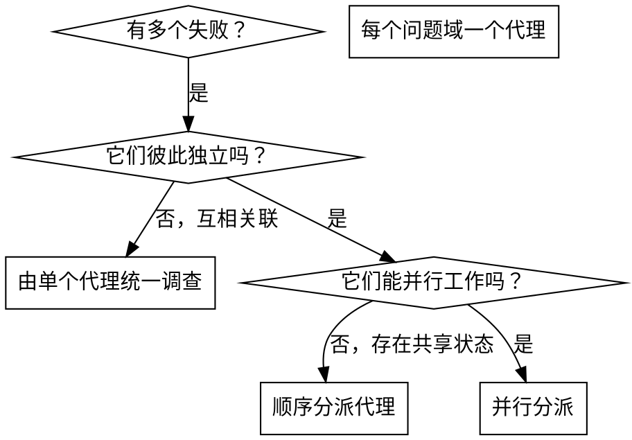

# 分派并行代理

## 概览

当你面对多个互不相关的失败时（不同测试文件、不同子系统、不同 bug），串行调查只会浪费时间。每项调查彼此独立，可以并行进行。

**核心原则：** 每个独立问题域分派一个代理，让它们并发工作。

## 何时使用



**适用场景：**
- 3 个以上测试文件失败，且根因不同
- 多个子系统彼此独立地损坏
- 每个问题都可以在不依赖其他上下文的情况下理解
- 各项调查之间不存在共享状态

**不适用场景：**
- 各个失败之间有关联（修一个可能会带着修好其他）
- 需要先理解整个系统状态
- 多个代理会互相干扰

## 模式

### 1. 识别独立的问题域

按照“坏掉的是什么”来分组：
- File A tests: Tool approval flow
- File B tests: Batch completion behavior
- File C tests: Abort functionality

每个域都是独立的，修复 tool approval 不会影响 abort 相关测试。

### 2. 创建聚焦的代理任务

每个代理都应得到：
- **明确范围：** 一个测试文件或一个子系统
- **清晰目标：** 让这些测试通过
- **约束条件：** 不修改其他代码
- **期望输出：** 总结你发现了什么、修了什么

### 3. 并行分派

```typescript
// In Claude Code / AI environment
Task("Fix agent-tool-abort.test.ts failures")
Task("Fix batch-completion-behavior.test.ts failures")
Task("Fix tool-approval-race-conditions.test.ts failures")
// All three run concurrently
```

### 4. 审查并集成

当代理返回结果后：
- 阅读每份摘要
- 验证修复之间没有冲突
- 运行完整测试套件
- 集成所有改动

## 代理提示词结构

好的代理提示词应当具备：
1. **聚焦** - 只有一个明确的问题域
2. **自包含** - 包含理解问题所需的全部上下文
3. **输出明确** - 代理最终应返回什么

```markdown
Fix the 3 failing tests in src/agents/agent-tool-abort.test.ts:

1. "should abort tool with partial output capture" - expects 'interrupted at' in message
2. "should handle mixed completed and aborted tools" - fast tool aborted instead of completed
3. "should properly track pendingToolCount" - expects 3 results but gets 0

These are timing/race condition issues. Your task:

1. Read the test file and understand what each test verifies
2. Identify root cause - timing issues or actual bugs?
3. Fix by:
   - Replacing arbitrary timeouts with event-based waiting
   - Fixing bugs in abort implementation if found
   - Adjusting test expectations if testing changed behavior

Do NOT just increase timeouts - find the real issue.

Return: Summary of what you found and what you fixed.
```

## 常见错误

**❌ 太宽泛：** "Fix all the tests" - 代理会失焦
**✅ 更合适：** "Fix agent-tool-abort.test.ts" - 范围清晰

**❌ 没上下文：** "Fix the race condition" - 代理不知道从哪开始
**✅ 有上下文：** 把错误信息和测试名贴出来

**❌ 没约束：** 代理可能把所有东西都重构了
**✅ 有约束：** "Do NOT change production code" 或 "Fix tests only"

**❌ 输出含糊：** "Fix it" - 你不知道它改了什么
**✅ 输出明确：** "Return summary of root cause and changes"

## 何时不要使用

**失败彼此关联：** 修复一个可能顺带修掉其他，先统一调查
**需要完整上下文：** 理解问题必须看到整个系统
**探索式调试：** 你甚至还不知道到底坏在哪里
**存在共享状态：** 代理会互相干扰（编辑同一文件、抢同一资源）

## 来自实际会话的例子

**场景：** 一次大重构后，3 个文件里一共出现了 6 个测试失败

**失败情况：**
- agent-tool-abort.test.ts: 3 failures (timing issues)
- batch-completion-behavior.test.ts: 2 failures (tools not executing)
- tool-approval-race-conditions.test.ts: 1 failure (execution count = 0)

**判断：** 这是独立问题域，abort 逻辑、batch completion、race condition 彼此分离

**分派方式：**
```
Agent 1 → Fix agent-tool-abort.test.ts
Agent 2 → Fix batch-completion-behavior.test.ts
Agent 3 → Fix tool-approval-race-conditions.test.ts
```

**结果：**
- Agent 1：把 timeout 改成基于事件的等待
- Agent 2：修复事件结构 bug（threadId 放错位置）
- Agent 3：补上等待异步工具执行完成的逻辑

**集成结果：** 全部修复相互独立、没有冲突，完整测试套件通过

**节省时间：** 3 个问题并行解决，而不是串行排队

## 关键收益

1. **并行化** - 多项调查同时发生
2. **更聚焦** - 每个代理范围更窄，要追踪的上下文更少
3. **相互独立** - 代理之间不互相干扰
4. **更快** - 用解决 1 个问题的时间接近解决 3 个问题

## 验证

代理返回后：
1. **逐份审查摘要** - 搞清楚每项改动是什么
2. **检查冲突** - 代理有没有改到同一块代码
3. **运行完整套件** - 验证所有修复能一起工作
4. **抽样复核** - 代理也可能犯系统性错误

## 现实影响

来自一次调试会话（2025-10-03）：
- 3 个文件里共有 6 个失败
- 并行分派了 3 个代理
- 所有调查同步完成
- 所有修复顺利集成
- 代理之间没有任何冲突
