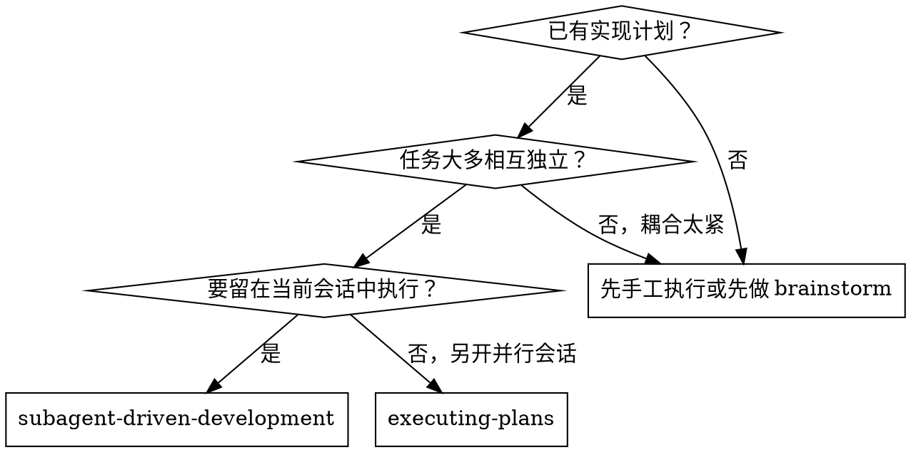
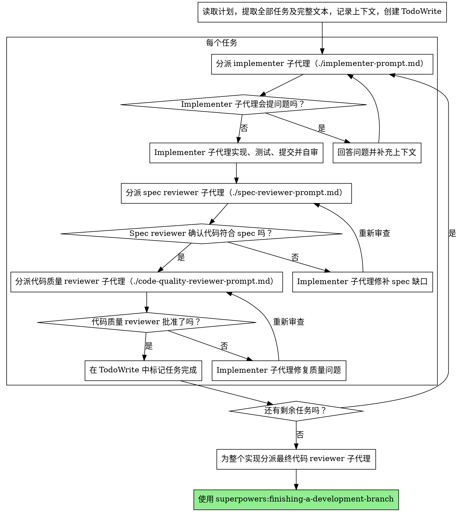

# 子代理驱动开发

通过为每个任务分派全新的子代理来执行计划，并在每个任务后做两阶段审查：先审 spec 一致性，再审代码质量。

**核心原则：** 每个任务一个全新子代理 + 两阶段审查（先 spec，后质量）= 更高质量、更快迭代。

## 何时使用



**相对 Executing Plans（并行会话）的区别：**
- 保持在同一会话内（没有上下文切换成本）
- 每个任务一个全新子代理（没有上下文污染）
- 每个任务之后都做两阶段审查：先 spec 一致性，再代码质量
- 迭代更快（任务之间无需人工介入）

## 流程



## 模型选择

在能够胜任的前提下，为每个角色选择能力尽可能低的模型，以节省成本并提高速度。

**机械式实现任务**（独立函数、规格清晰、只涉及 1 到 2 个文件）：用快而便宜的模型。只要计划足够清楚，大多数实现任务本质上都是机械执行。

**集成与判断任务**（多文件协调、模式匹配、调试）：用标准模型。

**架构、设计与审查任务**：使用能力最强的可用模型。

**任务复杂度信号：**
- 只涉及 1 到 2 个文件，且 spec 完整 → 便宜模型
- 涉及多个文件，并有集成顾虑 → 标准模型
- 需要设计判断或较广的代码库理解 → 最强模型

## 处理 Implementer 的状态

Implementer 子代理会返回 4 种状态之一。你必须正确处理它们：

**DONE：** 进入 spec 一致性审查。

**DONE_WITH_CONCERNS：** implementer 完成了任务，但标记了疑虑。先读这些疑虑，再决定是否继续。如果疑虑涉及正确性或范围，先解决再审查；如果只是观察性备注（例如“这个文件越来越大了”），记下来后继续进入审查。

**NEEDS_CONTEXT：** implementer 缺少必要信息。补上上下文后重新分派。

**BLOCKED：** implementer 无法完成任务。你要判断卡点在哪里：
1. 如果是上下文不够，就补充上下文，并用同一个模型重新分派
2. 如果是任务需要更强推理能力，就换更强的模型重新分派
3. 如果是任务太大，就把任务拆小
4. 如果是计划本身错了，就升级给人工伙伴

**绝不要** 无视升级信号，也不要在不做任何调整的情况下强迫同一个模型重试。如果 implementer 说卡住了，就说明某些条件必须改变。

## 提示词模板

- `./implementer-prompt.md` - 分派 implementer 子代理
- `./spec-reviewer-prompt.md` - 分派 spec 一致性 reviewer 子代理
- `./code-quality-reviewer-prompt.md` - 分派代码质量 reviewer 子代理

## 示例工作流

```
You: I'm using Subagent-Driven Development to execute this plan.

[Read plan file once: docs/superpowers/plans/feature-plan.md]
[Extract all 5 tasks with full text and context]
[Create TodoWrite with all tasks]

Task 1: Hook installation script

[Get Task 1 text and context (already extracted)]
[Dispatch implementation subagent with full task text + context]

Implementer: "Before I begin - should the hook be installed at user or system level?"

You: "User level (~/.config/superpowers/hooks/)"

Implementer: "Got it. Implementing now..."
[Later] Implementer:
  - Implemented install-hook command
  - Added tests, 5/5 passing
  - Self-review: Found I missed --force flag, added it
  - Committed

[Dispatch spec compliance reviewer]
Spec reviewer: ✅ Spec compliant - all requirements met, nothing extra

[Get git SHAs, dispatch code quality reviewer]
Code reviewer: Strengths: Good test coverage, clean. Issues: None. Approved.

[Mark Task 1 complete]

Task 2: Recovery modes

[Get Task 2 text and context (already extracted)]
[Dispatch implementation subagent with full task text + context]

Implementer: [No questions, proceeds]
Implementer:
  - Added verify/repair modes
  - 8/8 tests passing
  - Self-review: All good
  - Committed

[Dispatch spec compliance reviewer]
Spec reviewer: ❌ Issues:
  - Missing: Progress reporting (spec says "report every 100 items")
  - Extra: Added --json flag (not requested)

[Implementer fixes issues]
Implementer: Removed --json flag, added progress reporting

[Spec reviewer reviews again]
Spec reviewer: ✅ Spec compliant now

[Dispatch code quality reviewer]
Code reviewer: Strengths: Solid. Issues (Important): Magic number (100)

[Implementer fixes]
Implementer: Extracted PROGRESS_INTERVAL constant

[Code reviewer reviews again]
Code reviewer: ✅ Approved

[Mark Task 2 complete]

...

[After all tasks]
[Dispatch final code-reviewer]
Final reviewer: All requirements met, ready to merge

Done!
```

## 优势

**相对于手工执行：**
- 子代理天然更容易遵循 TDD
- 每个任务都有新鲜上下文（不容易混淆）
- 对并行更安全（子代理之间不会互相干扰）
- 子代理在开始前和过程中都可以提问题

**相对于 Executing Plans：**
- 保持同一会话（没有交接成本）
- 进度连续推进（不用等待）
- 审查检查点是自动嵌入流程里的

**效率收益：**
- 没有让子代理自己读文件的额外成本（controller 直接给完整文本）
- controller 可以精确挑选需要的上下文
- 子代理一开始就拿到完整信息
- 问题会在开工前暴露，而不是干到一半才冒出来

**质量闸门：**
- 自审会在交接前先拦下一批问题
- 两阶段审查：先 spec 一致性，再代码质量
- 审查循环能确保修复真的生效
- spec 一致性能防止做多或做少
- 代码质量审查确保实现本身站得住

**成本：**
- 需要更多子代理调用（每个任务 1 个 implementer + 2 个 reviewer）
- controller 前期准备更多（提前提取全部任务）
- 审查循环会增加迭代次数
- 但问题会更早暴露，总体上比后面调试更省成本

## 红旗信号

**绝不要：**
- 没有用户明确同意，就在 main/master 分支上开始实现
- 跳过任何一种审查（spec 一致性或代码质量）
- 带着未修复的问题继续推进
- 并行分派多个实现子代理（会冲突）
- 让子代理自己去读计划文件（你应该直接给完整文本）
- 跳过场景铺垫上下文（子代理需要知道任务在整体中的位置）
- 无视子代理问题（先回答，再让它继续）
- 在 spec 一致性上接受“差不多就行”（只要 reviewer 找到问题，就说明还没完成）
- 跳过审查循环（reviewer 找到问题 → implementer 修 → reviewer 重新审）
- 用 implementer 自审替代正式审查（两者都需要）
- **在 spec 一致性还没 ✅ 之前就启动代码质量审查**（顺序错了）
- 任一审查还有未关闭问题时，就进入下一个任务

**如果子代理提问：**
- 清楚、完整地回答
- 必要时补充更多上下文
- 不要催着它直接开工

**如果 reviewer 找到问题：**
- 由 implementer（同一个子代理）来修
- reviewer 再审一轮
- 重复，直到 approved
- 不要跳过复审

**如果子代理没完成任务：**
- 带着明确指令分派修复子代理
- 不要自己手动插进去修（会污染上下文）

## 集成关系

**必需的工作流技能：**
- **superpowers:using-git-worktrees** - 必需：开始前先准备隔离工作区
- **superpowers:writing-plans** - 生成本技能要执行的计划
- **superpowers:requesting-code-review** - 为 reviewer 子代理提供代码评审模板
- **superpowers:finishing-a-development-branch** - 在所有任务完成后负责收尾

**子代理应使用：**
- **superpowers:test-driven-development** - 让子代理对每个任务都遵循 TDD

**替代工作流：**
- **superpowers:executing-plans** - 如果不是在同一会话执行，而是另开并行会话，就用它
