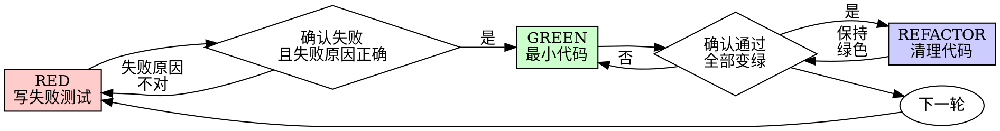

# 测试驱动开发（TDD）

## 概览

先写测试。看它失败。再写最小代码让它通过。

**核心原则：** 如果你没有亲眼看到测试失败，你就不知道它测的是不是正确的东西。

**违背规则的字面要求，也是在违背规则的精神。**

## 何时使用

**始终适用：**
- 新功能
- Bug 修复
- 重构
- 行为变更

**例外情况（要先问人工伙伴）：**
- 一次性原型
- 生成代码
- 配置文件

如果你正在想“这次就先跳过 TDD 吧”，停下。这就是在找借口。

## 铁律

```
NO PRODUCTION CODE WITHOUT A FAILING TEST FIRST
```

先写了代码才去补测试？删掉，重来。

**没有例外：**
- 不要把它留作“参考”
- 不要一边写测试一边“顺手改改它”
- 不要再去看它
- Delete 就是 delete

基于测试重新实现。就这么做。

## 红-绿-重构



### RED - 写失败测试

写一个最小测试，明确展示“应该发生什么”。

<Good>
```typescript
test('retries failed operations 3 times', async () => {
  let attempts = 0;
  const operation = () => {
    attempts++;
    if (attempts < 3) throw new Error('fail');
    return 'success';
  };

  const result = await retryOperation(operation);

  expect(result).toBe('success');
  expect(attempts).toBe(3);
});
```
名字清楚，测试真实行为，只测一件事
</Good>

<Bad>
```typescript
test('retry works', async () => {
  const mock = jest.fn()
    .mockRejectedValueOnce(new Error())
    .mockRejectedValueOnce(new Error())
    .mockResolvedValueOnce('success');
  await retryOperation(mock);
  expect(mock).toHaveBeenCalledTimes(3);
});
```
名字含糊，测的是 mock，不是代码行为
</Bad>

**要求：**
- 只测一个行为
- 名字清楚
- 尽量测真实代码（除非无法避免，否则不要 mock）

### 验证 RED - 看它失败

**强制要求。绝不能跳过。**

```bash
npm test path/to/test.test.ts
```

确认：
- 测试失败了（不是报错中断）
- 失败信息符合预期
- 失败原因是“功能还没实现”，而不是拼写错误之类的低级问题

**测试居然通过了？** 说明你测的是既有行为。去修测试。

**测试报错了？** 先修掉测试本身的错误，重跑，直到它以正确原因失败。

### GREEN - 最小实现

写出最简单、刚好能让测试通过的代码。

<Good>
```typescript
async function retryOperation<T>(fn: () => Promise<T>): Promise<T> {
  for (let i = 0; i < 3; i++) {
    try {
      return await fn();
    } catch (e) {
      if (i === 2) throw e;
    }
  }
  throw new Error('unreachable');
}
```
刚好够通过
</Good>

<Bad>
```typescript
async function retryOperation<T>(
  fn: () => Promise<T>,
  options?: {
    maxRetries?: number;
    backoff?: 'linear' | 'exponential';
    onRetry?: (attempt: number) => void;
  }
): Promise<T> {
  // YAGNI
}
```
过度设计
</Bad>

不要顺手加功能，不要顺手重构别的代码，也不要做超出测试要求的“改进”。

### 验证 GREEN - 看它通过

**强制要求。**

```bash
npm test path/to/test.test.ts
```

确认：
- 这个测试通过了
- 其他测试也还通过
- 输出是干净的（没有错误、没有警告）

**测试失败？** 修代码，不要去改测试来迎合错误结果。

**其他测试失败？** 现在就修。

### REFACTOR - 清理代码

只有在 GREEN 之后才能做：
- 消除重复
- 改善命名
- 提取辅助函数

整个过程要保持测试继续为绿。不要新增行为。

### 重复下一轮

为下一个功能再写一个新的失败测试。

## 好测试的标准

| 维度 | 好 | 坏 |
|---------|------|-----|
| **最小化** | 只测一件事。名字里出现 "and"？那就拆开。 | `test('validates email and domain and whitespace')` |
| **清晰** | 名字能描述行为 | `test('test1')` |
| **体现意图** | 能展示期望 API | 让人看不出代码到底该做什么 |

## 为什么顺序很重要

**“我先写代码，之后再补测试验证”**

代码写完之后补的测试，通常一上来就会通过。而“立刻通过”什么都证明不了：
- 你可能测错了东西
- 你可能测的是实现细节，不是行为
- 你可能漏掉了自己忘记的边界情况
- 你从未亲眼见过它真的抓住 bug

测试先行会逼你先看到失败，这才能证明测试真的在测某样东西。

**“我已经手工测过所有边界情况了”**

手工测试是临时性的。你以为自己都测到了，但实际上：
- 没有任何记录说明你到底测了什么
- 代码一变，你没法稳定重跑
- 一有压力就很容易忘掉某些 case
- “我试的时候是好的” 不等于完整覆盖

自动化测试才是系统化的。每次运行都以同样的方式执行。

**“删掉我做了几个小时的代码太浪费了”**

这是沉没成本谬误。花掉的时间已经回不来了。你现在只有两个选择：
- 删掉，然后按 TDD 重写（多花 X 小时，但置信度高）
- 保留它，事后补测试（省 30 分钟，但置信度低，还大概率埋 bug）

真正的“浪费”是把一段你根本不敢信任的代码留在系统里。没有真实测试支撑的“能跑代码”就是技术债。

**“TDD 太教条了，真正务实的人应该灵活一点”**

TDD 本身就是务实：
- 在提交前抓出 bug（比事后调试快）
- 防止回归（测试会立刻抓住破坏）
- 记录行为（测试本身就是使用说明）
- 支持重构（你可以放心改，测试会替你兜底）

所谓“务实捷径”，最后往往就是去生产环境调试，结果只会更慢。

**“事后补测试也能达到同样目标，关键是精神不是形式”**

不对。事后补的测试回答的是“这段代码现在做了什么”；测试先行回答的是“它本来应该做什么”。

事后补测试会被你已有实现强烈影响。你会去测自己已经写出来的东西，而不是原本的需求；你验证的是你还记得的边界情况，而不是你在设计前应该被迫发现的边界情况。

测试先行会迫使你在实现前就发现边界情况。事后补测试只是验证你有没有把所有东西都记住，而你通常记不全。

事后补 30 分钟测试 ≠ TDD。你可能得到一些覆盖率，但失去了“测试真的有效”的证据。

## 常见借口

| 借口 | 现实 |
|--------|---------|
| "Too simple to test" | 简单代码一样会坏。写个测试只要 30 秒。 |
| "I'll test after" | 立刻通过的测试什么都证明不了。 |
| "Tests after achieve same goals" | 事后补测试回答“现在它做什么”；测试先行回答“它应该做什么”。 |
| "Already manually tested" | 临时测试不等于系统化测试。没有记录，也不能稳定重跑。 |
| "Deleting X hours is wasteful" | 这是沉没成本谬误。保留未经验证的代码就是技术债。 |
| "Keep as reference, write tests first" | 你一定会去“参考”它，那仍然是事后补测试。Delete 就是 delete。 |
| "Need to explore first" | 可以。探索完扔掉，然后按 TDD 正式开始。 |
| "Test hard = design unclear" | 听测试的反馈。难测就往往也难用。 |
| "TDD will slow me down" | TDD 比事后调试更快。务实就意味着先测。 |
| "Manual test faster" | 手工测试无法证明边界情况。每次改动你都得重测。 |
| "Existing code has no tests" | 那更说明你现在是在改善它。给现有代码补测试。 |

## 红旗信号：停下并重来

- 先写了代码，后写测试
- 实现完才去补测试
- 测试一上来就通过
- 说不清测试为什么失败
- 想着“测试之后再说”
- 开始说服自己“就这一次”
- "I already manually tested it"
- "Tests after achieve the same purpose"
- "It's about spirit not ritual"
- 想把旧代码“留作参考”或者“稍微改改拿来用”
- "Already spent X hours, deleting is wasteful"
- "TDD is dogmatic, I'm being pragmatic"
- "This is different because..."

**这些都意味着：删掉代码，按 TDD 重来。**

## 示例：修 bug

**Bug：** 空邮箱被错误接受

**RED**
```typescript
test('rejects empty email', async () => {
  const result = await submitForm({ email: '' });
  expect(result.error).toBe('Email required');
});
```

**验证 RED**
```bash
$ npm test
FAIL: expected 'Email required', got undefined
```

**GREEN**
```typescript
function submitForm(data: FormData) {
  if (!data.email?.trim()) {
    return { error: 'Email required' };
  }
  // ...
}
```

**验证 GREEN**
```bash
$ npm test
PASS
```

**REFACTOR**
如果需要，可以把多个字段的校验逻辑提取出来。

## 验证清单

在宣告工作完成之前：

- [ ] 每个新函数 / 方法都有测试
- [ ] 每个测试在实现前都亲眼看过它失败
- [ ] 每个测试都因预期原因失败（功能缺失，而不是拼写错误）
- [ ] 为每个测试只写了最小实现
- [ ] 所有测试都通过
- [ ] 输出是干净的（没有错误、没有警告）
- [ ] 测试尽量使用真实代码（只有在迫不得已时才 mock）
- [ ] 边界情况和错误情况都有覆盖

有任何一项打不了勾？说明你跳过了 TDD。重来。

## 卡住时怎么办

| 问题 | 解决办法 |
|---------|----------|
| 不知道怎么测试 | 先写你希望存在的 API，先写断言，再去问人工伙伴。 |
| 测试太复杂 | 说明设计太复杂。先简化接口。 |
| 什么都得 mock | 说明代码耦合太高。使用依赖注入。 |
| 测试准备代码太大 | 提取辅助函数。如果还是复杂，就继续简化设计。 |

## 与调试的结合

发现 bug 了？先写能复现它的失败测试。然后走完整个 TDD 循环。测试既能证明修复有效，也能防止回归。

永远不要在没有测试的情况下修 bug。

## 测试反模式

当你需要添加 mock 或测试工具时，先读 @testing-anti-patterns.md，避免这些常见陷阱：
- 测的是 mock 的行为，而不是系统的真实行为
- 为了测试给生产类硬加测试专用方法
- 在没搞懂依赖关系前就盲目 mock

## 最终规则

```
Production code → test exists and failed first
Otherwise → not TDD
```

没有人工伙伴明确许可，就没有例外。
