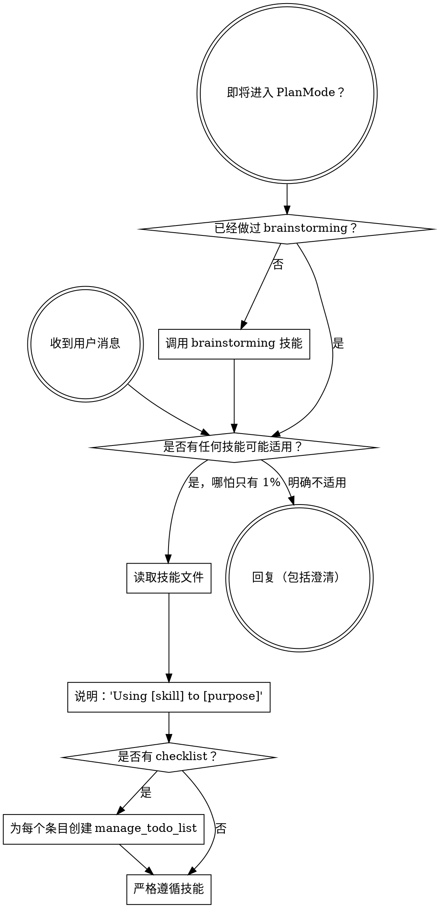

<SUBAGENT-STOP>
如果你是作为子代理被派来执行某个具体任务的，请跳过本技能。
</SUBAGENT-STOP>

<EXTREMELY-IMPORTANT>
如果你认为某个技能哪怕只有 1% 的可能适用于你当前的工作，你都绝对必须调用它。

如果某个技能适用于你的任务，你就没有选择余地。你必须使用它。

这不是可以商量的事，也不是可选项。你不能靠自我说服绕开这条规则。
</EXTREMELY-IMPORTANT>

## 指令优先级

Superpowers 技能会覆盖默认系统提示中的行为，但 **用户指令永远优先**：

1. **用户的显式指令**（copilot-instructions.md、.instructions.md、直接请求）— 最高优先级
2. **Superpowers 技能** — 在与默认系统行为冲突时覆盖默认行为
3. **默认系统提示** — 最低优先级

如果项目指令写着“不要用 TDD”，而某个技能写着“始终使用 TDD”，那就遵循用户指令。控制权在用户手里。

## 如何访问技能

使用 `read_file` 读取技能的 SKILL.md 文件来加载技能。技能通常通过 `.github/copilot-instructions.md` 中的文件路径被引用。

## 工具映射

有些技能会引用 Claude Code 的工具名。请使用下列 Copilot 对应项：

- `Task` → `runSubagent`
- `TodoWrite` → `manage_todo_list`
- `Skill` → `read_file` on the SKILL.md path
- `Read` / `Write` / `Edit` → `read_file` / `create_file` / `replace_string_in_file`
- `Bash` → `run_in_terminal`

完整映射见：`references/copilot-tools.md`

# 使用技能

## 规则

**在做出任何回复或动作之前，先调用相关技能或被明确要求的技能。** 只要某个技能有 1% 的可能适用，就先调用它来确认。如果调用后发现不适用，可以不用继续遵循它。

## 红旗信号

一旦出现下面这些念头，就该立刻停下，因为你正在为跳过流程找借口：

| 想法 | 现实 |
|---------|---------|
| "这只是个简单问题" | 问题也是任务。先检查技能。 |
| "我得先补一点上下文" | 技能检查发生在澄清问题之前。 |
| "我先看看代码库" | 技能会告诉你该怎么探索。先检查技能。 |
| "我先快速看下 git/文件" | 单看文件没有对话上下文。先检查技能。 |
| "我先收集一点信息" | 技能会告诉你该怎么收集信息。 |
| "这不需要正式技能" | 只要有技能，就该用。 |
| "这个技能我记得" | 技能会演化。读当前版本。 |
| "这不算任务" | 只要有动作就是任务。先检查技能。 |
| "这个技能太重了" | 简单的事也会变复杂。用它。 |
| "我先做这一小步" | 任何动作前都先检查技能。 |
| "这样看起来更有效率" | 无纪律的动作只会浪费时间。技能就是为了防止这件事。 |
| "我知道它是什么意思" | 知道概念不等于真正使用技能。去调用它。 |

## 技能优先级

如果多个技能都可能适用，按下面的顺序处理：

1. **先流程技能**（brainstorming、debugging）— 它们决定你该如何处理任务
2. **后实现技能**（frontend-design、mcp-builder）— 它们指导具体执行

“Let's build X” → 先 brainstorming，再看实现技能。
“Fix this bug” → 先 debugging，再看领域技能。

## 技能类型

**刚性技能**（TDD、debugging）：严格照做。不要为了“灵活”牺牲纪律。

**柔性技能**（patterns）：根据上下文调整原则的具体应用。

技能文档本身会告诉你它属于哪一类。

## 用户指令

指令定义的是做什么，不是怎么做。“Add X” 或 “Fix Y” 并不意味着你可以跳过工作流。
