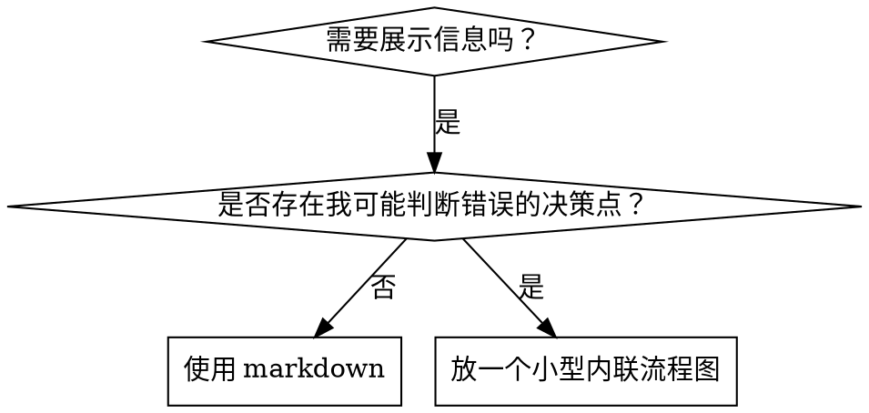

# 编写技能

## 概览

**编写 Skill，本质上就是把测试驱动开发应用到流程文档上。**

**个人 Skill 存放在各代理专属目录中（Claude Code 使用 `~/.claude/skills`，Codex 使用 `~/.agents/skills/`）**

你要先写测试用例（带子代理的压力场景），观察它失败（基线行为），再写 Skill（文档），观察测试通过（代理遵循要求），最后重构（堵住漏洞）。

**核心原则：** 如果你没有亲眼看过代理在没有 Skill 的情况下失败，你就不知道这个 Skill 是否真的教会了正确的东西。

**必需背景：** 在使用本 Skill 之前，你**必须**理解 superpowers:test-driven-development。那个 Skill 定义了基础的 RED-GREEN-REFACTOR 循环；本 Skill 只是把 TDD 适配到文档上。

**官方指导：** 关于 Anthropic 官方的 Skill 编写最佳实践，见 anthropic-best-practices.md。这个文档提供了额外的模式与指导，用来补充本 Skill 中以 TDD 为核心的方法。

## 什么是 Skill？

**Skill** 是针对已验证技巧、模式或工具的参考指南。Skill 能帮助未来的 Claude 实例找到并应用有效的方法。

**Skill 是：** 可复用的技巧、模式、工具、参考指南

**Skill 不是：** 关于你某次如何解决一个问题的叙事回顾

## Skill 的 TDD 映射

| TDD 概念 | Skill 创建 |
|-------------|----------------|
| **测试用例** | 带子代理的压力场景 |
| **生产代码** | Skill 文档（SKILL.md） |
| **测试失败（RED）** | 没有 Skill 时代理违反规则（基线） |
| **测试通过（GREEN）** | 有 Skill 时代理能够遵循 |
| **重构** | 在保持遵循的前提下堵住漏洞 |
| **先写测试** | 写 Skill 之前先运行基线场景 |
| **观察它失败** | 逐字记录代理使用的借口 |
| **最小化代码** | 只写解决这些具体违规的 Skill |
| **观察它通过** | 验证代理现在会遵循 |
| **重构循环** | 发现新的借口 → 堵上 → 重新验证 |

整个 Skill 创建过程都遵循 RED-GREEN-REFACTOR。

## 何时创建 Skill

**在以下情况创建：**
- 这个技巧对你来说并不是直觉上显而易见的
- 你以后在不同项目里还会再次参考它
- 这个模式具有广泛适用性（而不是项目特定）
- 其他人也会从中受益

**以下情况不要创建：**
- 一次性的解决方案
- 其他地方已经有充分文档记录的标准实践
- 项目特定的约定（放到 CLAUDE.md 里）
- 纯机械性约束（如果能用 regex/validation 强制执行，就把它自动化，把文档留给需要判断的场景）

## Skill 类型

### Technique

带有明确步骤的具体方法（condition-based-waiting、root-cause-tracing）

### Pattern

思考问题的方式（flatten-with-flags、test-invariants）

### Reference

API 文档、语法指南、工具文档（office docs）

## 目录结构

```text
skills/
  skill-name/
    SKILL.md              # 主参考文档（必需）
    supporting-file.*     # 仅在需要时提供
```

**扁平命名空间** - 所有 Skill 都位于一个可搜索的命名空间中

**在以下情况拆分文件：**
1. **重型参考资料**（100+ 行）- API 文档、完整语法说明
2. **可复用工具** - 脚本、工具函数、模板

**以下内容保持内联：**
- 原则和概念
- 代码模式（< 50 行）
- 其他所有内容

## SKILL.md 结构

**Frontmatter（YAML）：**
- 只支持两个字段：`name` 和 `description`
- 总长度上限 1024 个字符
- `name`：只使用字母、数字和连字符（不要有括号、特殊字符）
- `description`：使用第三人称，只描述**何时使用**（不要描述它做什么）
  - 以 `"Use when..."` 开头，把重点放在触发条件上
  - 包含具体的症状、场景和上下文
  - **绝不要总结 Skill 的过程或工作流**（原因见下方 CSO 章节）
  - 尽量控制在 500 个字符以内

```markdown
---
name: Skill-Name-With-Hyphens
description: Use when [specific triggering conditions and symptoms]
---

# Skill 名称

## 概览
这是什么？用 1-2 句话说明核心原则。

## 何时使用
[如果决策并不明显，可放一个小型内联流程图]

用项目列表列出症状和使用场景
何时不要使用

## 核心模式（适用于 technique/pattern）
前后代码对比

## 快速参考
用表格或项目列表快速扫描常见操作

## 实现
简单模式直接内联代码
较重的参考资料或可复用工具则链接到单独文件

## 常见错误
会出什么问题 + 如何修复

## 真实影响（可选）
具体结果
```


## Claude 搜索优化（CSO）

**对可发现性至关重要：** 未来的 Claude 必须能**找到**你的 Skill

### 1. 丰富的 Description 字段

**目的：** Claude 会读取 description，决定在某个任务里要加载哪些 Skill。它必须回答这个问题：“我现在应该读这个 Skill 吗？”

**格式：** 以 `"Use when..."` 开头，把重点放在触发条件上

**关键：Description = 何时使用，而不是 Skill 做什么**

description 只能描述触发条件。不要在 description 中总结 Skill 的过程或工作流。

**为什么这很重要：** 测试表明，当 description 总结了 Skill 的工作流时，Claude 可能会直接照着 description 去做，而不去读完整的 Skill 内容。一个写着 “code review between tasks” 的 description，会让 Claude 只做**一次**审查，尽管 Skill 里的流程图清楚地写了要做**两次**审查（先做规范符合性，再做代码质量）。

当 description 被改成只有 “Use when executing implementation plans with independent tasks”（不总结工作流）后，Claude 才会正确读取流程图，并遵循两阶段审查流程。

**陷阱：** 会总结工作流的 description 会变成 Claude 走的捷径。于是 Skill 正文就变成了 Claude 会跳过的文档。

```yaml
# ❌ BAD：总结了工作流 - Claude 可能照这个执行，而不是去读 Skill
description: Use when executing plans - dispatches subagent per task with code review between tasks

# ❌ BAD：流程细节太多
description: Use for TDD - write test first, watch it fail, write minimal code, refactor

# ✅ GOOD：只有触发条件，不总结工作流
description: Use when executing implementation plans with independent tasks in the current session

# ✅ GOOD：只写触发条件
description: Use when implementing any feature or bugfix, before writing implementation code
```

**内容要求：**
- 使用具体的触发器、症状和场景，表明这个 Skill 适用
- 描述的是**问题**（race conditions、不一致行为），而不是**语言特定症状**（setTimeout、sleep）
- 除非 Skill 本身是技术特定的，否则触发条件应尽量与技术无关
- 如果 Skill 是技术特定的，就要在触发条件里明确说出来
- 使用第三人称（它会被注入到 system prompt）
- **绝不要总结 Skill 的过程或工作流**

```yaml
# ❌ BAD：太抽象、太模糊，没有包含何时使用
description: For async testing

# ❌ BAD：第一人称
description: I can help you with async tests when they're flaky

# ❌ BAD：提到了技术，但 Skill 本身并不局限于该技术
description: Use when tests use setTimeout/sleep and are flaky

# ✅ GOOD：以 "Use when" 开头，描述问题，不总结工作流
description: Use when tests have race conditions, timing dependencies, or pass/fail inconsistently

# ✅ GOOD：技术特定 Skill，触发条件明确
description: Use when using React Router and handling authentication redirects
```

### 2. 关键词覆盖

使用 Claude 会拿来搜索的词：
- 错误信息："Hook timed out"、"ENOTEMPTY"、"race condition"
- 症状："flaky"、"hanging"、"zombie"、"pollution"
- 同义词："timeout/hang/freeze"、"cleanup/teardown/afterEach"
- 工具：真实命令、库名、文件类型

### 3. 描述性命名

**使用主动语态，动词优先：**
- ✅ `creating-skills` 而不是 `skill-creation`
- ✅ `condition-based-waiting` 而不是 `async-test-helpers`

### 4. 令牌效率（关键）

**问题：** getting-started 和经常被引用的 Skill 会加载到**每一次**对话中。每一个 token 都重要。

**目标字数：**
- getting-started 工作流：每个 <150 词
- 高频加载 Skill：总计 <200 词
- 其他 Skill：<500 词（依然要简洁）

**技巧：**

**把细节移到工具帮助里：**
```bash
# ❌ BAD：在 SKILL.md 里记录所有 flag
search-conversations supports --text, --both, --after DATE, --before DATE, --limit N

# ✅ GOOD：引用 --help
search-conversations supports multiple modes and filters. Run --help for details.
```

**使用交叉引用：**
```markdown
# ❌ BAD：重复写工作流细节
搜索时，派发子代理并使用模板……
[20 行重复说明]

# ✅ GOOD：引用其他 Skill
始终使用子代理（节省 50-100 倍上下文）。**必需：** 工作流请使用 [other-skill-name]。
```

**压缩示例：**
```markdown
# ❌ BAD：冗长示例（42 个词）
你的人工协作者："我们之前是怎么处理 React Router 里的认证错误的？"
你：我会搜索过去关于 React Router 认证模式的对话记录。
[派发子代理，搜索查询："React Router authentication error handling 401"]

# ✅ GOOD：精简示例（20 个词）
协作者："我们之前怎么处理 React Router 里的 auth 错误？"
你：正在搜索……
[派发子代理 → 综合整理]
```

**消除冗余：**
- 不要重复其他被交叉引用的 Skill 已经写过的内容
- 不要解释从命令字面就能看明白的东西
- 不要为同一种模式放多个示例

**验证：**
```bash
wc -w skills/path/SKILL.md
# getting-started 工作流：目标是每个 <150
# 其他高频 Skill：总计目标 <200
```

**按你“做什么”或核心洞见来命名：**
- ✅ `condition-based-waiting` > `async-test-helpers`
- ✅ `using-skills` 而不是 `skill-usage`
- ✅ `flatten-with-flags` > `data-structure-refactoring`
- ✅ `root-cause-tracing` > `debugging-techniques`

**动名词（-ing）非常适合描述过程：**
- `creating-skills`、`testing-skills`、`debugging-with-logs`
- 主动、直接描述你正在执行的动作

### 4. 交叉引用其他 Skill

**当你在文档里引用其他 Skill 时：**

只使用 Skill 名称，并带上明确的必需标记：
- ✅ 好：`**REQUIRED SUB-SKILL:** Use superpowers:test-driven-development`
- ✅ 好：`**REQUIRED BACKGROUND:** You MUST understand superpowers:systematic-debugging`
- ❌ 坏：`See skills/testing/test-driven-development`（不清楚是不是必需）
- ❌ 坏：`@skills/testing/test-driven-development/SKILL.md`（会强制加载，浪费上下文）

**为什么不要用 @ 链接：** `@` 语法会立刻强制加载文件，在你真正需要之前就消耗掉 200k+ 的上下文。

## 流程图的使用



**只在以下情况使用流程图：**
- 不明显的决策点
- 容易过早停止的流程循环
- “什么时候该用 A，什么时候该用 B” 这类判断

**以下情况绝不要用流程图：**
- 参考资料 → 用表格、列表
- 代码示例 → 用 Markdown 代码块
- 线性指令 → 用编号列表
- 没有语义的标签（step1、helper2）

graphviz 风格规则见 @graphviz-conventions.dot。

**给你的人类协作者可视化：** 使用本目录下的 `render-graphs.js` 把 Skill 中的流程图渲染成 SVG：
```bash
./render-graphs.js ../some-skill           # 每个图单独输出
./render-graphs.js ../some-skill --combine # 所有图合并到一个 SVG
```

## 代码示例

**一个出色的示例，胜过很多平庸的示例**

选择最相关的语言：
- 测试技巧 → TypeScript/JavaScript
- 系统调试 → Shell/Python
- 数据处理 → Python

**好示例应当：**
- 完整且可运行
- 有清晰注释，说明**为什么**
- 来自真实场景
- 清楚展示模式
- 可直接改造（而不是通用模板）

**不要：**
- 用 5+ 种语言分别实现
- 写填空式模板
- 编造刻意的示例

你很擅长迁移，一个优秀示例就够了。

## 文件组织

### 自包含 Skill
```text
defense-in-depth/
  SKILL.md    # 所有内容都内联
```
适用场景：所有内容都装得下，不需要重型参考资料

### 带可复用工具的 Skill
```text
condition-based-waiting/
  SKILL.md    # 概览 + 模式
  example.ts  # 可直接改造的可用辅助代码
```
适用场景：工具本身是可复用代码，而不只是说明文字

### 带重型参考资料的 Skill
```text
pptx/
  SKILL.md       # 概览 + 工作流
  pptxgenjs.md   # 600 行 API 参考
  ooxml.md       # 500 行 XML 结构
  scripts/       # 可执行工具
```
适用场景：参考资料太大，不适合内联

## 铁律（与 TDD 相同）

```
没有先失败的测试，就不要写 Skill
```

这条规则同时适用于**新 Skill**和**对现有 Skill 的编辑**。

先写 Skill 再测试？删掉它。重来。
改 Skill 却不测试？同样违规。

**没有例外：**
- 不是因为“只是简单补充”
- 不是因为“只是多加一节”
- 不是因为“只是文档更新”
- 不要把未经测试的改动保留成“参考”
- 不要一边跑测试一边“顺手改”
- 说删除就是真的删除

**必需背景：** superpowers:test-driven-development 这个 Skill 解释了为什么这件事重要。同样的原则也适用于文档。

## 测试所有 Skill 类型

不同类型的 Skill 需要不同的测试方法：

### 强化纪律型 Skill（规则/要求）

**示例：** TDD、verification-before-completion、designing-before-coding

**测试方式：**
- 学术式问题：他们是否理解这些规则？
- 压力场景：他们在压力下是否依然遵守？
- 组合压力：时间压力 + 沉没成本 + 疲惫
- 找出借口，并补上明确的反制说明

**成功标准：** 代理在最大压力下依然遵循规则

### Technique 型 Skill（操作指南）

**示例：** condition-based-waiting、root-cause-tracing、defensive-programming

**测试方式：**
- 应用场景：他们能否正确应用这个技巧？
- 变体场景：他们能否处理边界情况？
- 信息缺失测试：说明里是否存在缺口？

**成功标准：** 代理能在新的场景中成功应用该技巧

### Pattern 型 Skill（思维模型）

**示例：** reducing-complexity、information-hiding concepts

**测试方式：**
- 识别场景：他们是否知道这个模式何时适用？
- 应用场景：他们能否使用这个思维模型？
- 反例：他们是否知道何时**不该**使用？

**成功标准：** 代理能正确识别何时/如何应用这个模式

### Reference 型 Skill（文档/API）

**示例：** API 文档、命令参考、库指南

**测试方式：**
- 检索场景：他们能否找到正确的信息？
- 应用场景：他们能否正确使用找到的信息？
- 缺口测试：常见用例是否都覆盖到了？

**成功标准：** 代理能找到并正确使用参考信息

## 跳过测试的常见借口

| 借口 | 现实 |
|--------|---------|
| “Skill 已经写得很清楚了” | 对你清楚 ≠ 对其他代理清楚。去测试。 |
| “这只是个参考文档” | 参考文档同样可能有缺口和不清晰的地方。测试检索。 |
| “测试太小题大做了” | 未测试的 Skill 总会出问题。15 分钟测试能省下几小时。 |
| “等出了问题再测” | 出问题 = 代理用不了这个 Skill。上线前就要测。 |
| “测试太麻烦了” | 在生产环境里调试一个坏 Skill 更麻烦。 |
| “我很确定它已经够好了” | 过度自信几乎保证会出问题。照样测试。 |
| “学术性审阅就够了” | 阅读 ≠ 使用。要测应用场景。 |
| “没时间测试” | 部署未经测试的 Skill，后面返工会浪费更多时间。 |

**这些借口全都意味着：部署前先测试。没有例外。**

## 让 Skill 对“合理化借口”具备免疫力

用于强化纪律的 Skill（比如 TDD）必须能抵抗合理化借口。代理很聪明，在压力下会主动寻找漏洞。

**心理学说明：** 理解说服技巧**为什么**有效，能帮助你系统化应用它们。关于 authority、commitment、scarcity、social proof 和 unity 原则的研究基础，见 persuasion-principles.md（Cialdini, 2021；Meincke et al., 2025）。

### 明确堵住每一个漏洞

不要只是陈述规则，要明确禁止具体绕过方式：

<Bad>
```markdown
先写代码再写测试？删掉它。
```
</Bad>

<Good>
```markdown
先写代码再写测试？删掉它。重新开始。

**没有例外：**
- 不要把它保留成“参考”
- 不要一边写测试一边“顺手改”
- 不要去看它
- 说删除就是真的删除
```
</Good>

### 处理“精神 vs 字面”式争辩

尽早加入基础原则：

```markdown
**违反规则的字面要求，就是违反规则的精神。**
```

这能直接切断整类“我是在遵守精神”的借口。

### 构建“借口表”

从基线测试中捕捉合理化借口（见下方测试章节）。代理说出的每一个借口都放进这张表：

```markdown
| 借口 | 现实 |
|--------|---------|
| “太简单了，不值得测试” | 简单代码也会坏。测试只要 30 秒。 |
| “我之后会测” | 事后通过的测试什么都证明不了。 |
| “事后测试也能达到同样目标” | 事后测试 = “这东西做了什么？” 先测后写 = “它应该做什么？” |
```

### 创建“红旗清单”

让代理在开始合理化时更容易自我检查：

```markdown
## 红旗 - 立刻停下并重新开始

- 先写代码再写测试
- “我已经手工测试过了”
- “事后测试也能达到同样目的”
- “关键是精神，不是仪式”
- “这个情况不一样，因为……”

**这些都意味着：删掉代码。用 TDD 重新开始。**
```

### 更新 CSO，写入违规前兆症状

把你**即将**违反规则时的症状加到 description 里：

```yaml
description: use when implementing any feature or bugfix, before writing implementation code
```

## Skill 的 RED-GREEN-REFACTOR

遵循 TDD 循环：

### RED：写一个失败的测试（基线）

在**没有** Skill 的情况下，用子代理运行压力场景。记录准确行为：
- 他们做了哪些选择？
- 他们用了哪些借口（逐字记录）？
- 是哪些压力触发了违规？

这就是“看着测试失败”这一步。你必须先看见代理自然会怎么做，然后才能写 Skill。

### GREEN：写最小化 Skill

写一个只针对这些具体借口的 Skill。不要为了假设中的情况增加额外内容。

在**有** Skill 的情况下运行相同场景。代理现在应该会遵循要求。

### REFACTOR：堵住漏洞

代理又找到新的借口了？加上明确的反制说明。重新测试，直到足够稳固。

**测试方法：** 完整测试方法见 @testing-skills-with-subagents.md：
- 如何编写压力场景
- 压力类型（时间、沉没成本、权威、疲惫）
- 如何系统化堵漏洞
- 元测试技巧

## 反模式

### ❌ 叙事式示例
“在 2025-10-03 的会话里，我们发现 empty projectDir 导致了……”
**为什么不好：** 太具体，无法复用

### ❌ 多语言稀释
example-js.js, example-py.py, example-go.go
**为什么不好：** 质量平庸，维护负担重

### ❌ 在流程图里放代码
```dot
step1 [label="导入 fs"];
step2 [label="读取文件"];
```
**为什么不好：** 无法复制粘贴，也难以阅读

### ❌ 通用标签
helper1, helper2, step3, pattern4
**为什么不好：** 标签应该有语义

## 停止：在进入下一个 Skill 之前

**写完任何 Skill 之后，你都必须停下来完成部署流程。**

**不要：**
- 在不逐个测试的情况下批量创建多个 Skill
- 在当前 Skill 还没验证前就转去下一个
- 因为“批处理更高效”就跳过测试

**下面的部署检查清单对每一个 Skill 都是强制性的。**

部署未经测试的 Skill = 部署未经测试的代码。这违反质量标准。

## Skill 创建检查清单（TDD 适配版）

**重要：** 对下面**每一个**检查项，都要使用 TodoWrite 创建 todo。

**RED 阶段 - 写失败测试：**
- [ ] 创建压力场景（纪律型 Skill 至少 3 种组合压力）
- [ ] 在**没有** Skill 的情况下运行场景，逐字记录基线行为
- [ ] 识别借口/失败中的模式

**GREEN 阶段 - 写最小化 Skill：**
- [ ] 名称只使用字母、数字、连字符（不要括号/特殊字符）
- [ ] YAML frontmatter 中只有 name 和 description（总计最多 1024 字符）
- [ ] Description 以 `"Use when..."` 开头，并包含具体触发器/症状
- [ ] Description 使用第三人称
- [ ] 全文包含可搜索关键词（错误、症状、工具）
- [ ] 有清晰的概览与核心原则
- [ ] 明确回应 RED 阶段识别出的具体基线失败
- [ ] 代码内联，或链接到单独文件
- [ ] 一个优秀示例（不要多语言）
- [ ] 在**有** Skill 的情况下运行场景，验证代理现在会遵循

**REFACTOR 阶段 - 堵住漏洞：**
- [ ] 识别测试中新出现的借口
- [ ] 加入明确反制说明（如果是纪律型 Skill）
- [ ] 基于所有测试迭代构建借口表
- [ ] 创建红旗清单
- [ ] 反复测试，直到足够稳固

**质量检查：**
- [ ] 只有在决策不明显时才使用小型流程图
- [ ] 有快速参考表
- [ ] 有常见错误章节
- [ ] 没有叙事式讲故事
- [ ] 只有在工具或重型参考资料需要时才添加 supporting files

**部署：**
- [ ] 将 Skill 提交到 git，并推送到你的 fork（如果已配置）
- [ ] 如果具有广泛价值，考虑通过 PR 回馈

## 发现工作流

未来的 Claude 如何找到你的 Skill：

1. **遇到问题**（“tests are flaky”）
3. **找到 SKILL**（description 匹配）
4. **扫描概览**（这相关吗？）
5. **阅读模式**（快速参考表）
6. **加载示例**（只在真正实现时）

**要为这个流程做优化** - 把可搜索的词尽早、尽可能多地放进去。

## 结论

**创建 Skill，本质上就是流程文档版的 TDD。**

同样的铁律：没有先失败的测试，就不要写 Skill。
同样的循环：RED（基线）→ GREEN（写 Skill）→ REFACTOR（堵漏洞）。
同样的收益：更高质量、更少意外、更稳固的结果。

如果你对代码遵循 TDD，那对 Skill 也一样。只是把同样的纪律应用到了文档上。
